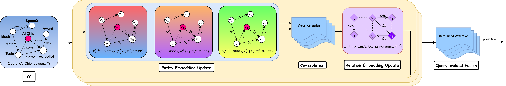

# GAMMA: Geometric-Structural-Knowledge-Graph-Foundation-Model

[](https://pytorch.org/get-started/locally/)
[](https://pytorch-geometric.readthedocs.io/en/latest/install/installation.html)
[](https://arxiv.org/abs/2512.22931)




GAMMA, a structural knowledge graph foundation model that overcomes the limitations of existing approaches by integrating multiple geometric transformations within a unified attention-based framework. Different with prior models that rely on a single transformation and thus introduce structural biases, GAMMA leverages multiple relational message passing mechanisms to dynamically adapt to the relational patterns present in the data.

---


## Installation ##

You may install the dependencies via either conda or pip. 
GAMMA is implemented with Python 3.9, PyTorch 2.1 and PyG 2.4 (CUDA 11.8 or later when running on GPUs). If you are on a Mac, you may omit the CUDA toolkit requirements.

### From Conda ###

```bash
conda install pytorch=2.1.0 pytorch-cuda=11.8 cudatoolkit=11.8 pytorch-scatter=2.1.2 pyg=2.4.0 -c pytorch -c nvidia -c pyg -c conda-forge
conda install ninja easydict pyyaml -c conda-forge
```

### From Pip ###

```bash
pip install torch==2.1.0 --index-url https://download.pytorch.org/whl/cu118
pip install torch-scatter==2.1.2 torch-sparse==0.6.18 torch-geometric==2.4.0 -f https://data.pyg.org/whl/torch-2.1.0+cu118.html
pip install ninja easydict pyyaml
```

<details>
<summary> Compilation of the `rspmm` kernel </summary>

To make relational message passing iteration `O(V)` instead of `O(E)` we ship a custom `rspmm` kernel that will be compiled automatically upon the first launch. The `rspmm` kernel supports `transe`, `distmult`, `complex`, `split-complex` and `dual` message functions, others will resort to full edge materialization and `O(E)` complexity.

The kernel can be compiled on both CPUs (including M1/M2 on Macs) and GPUs (it is done only once and then cached). For GPUs, you need a CUDA 11.8+ toolkit with the `nvcc` compiler. If you are deploying this in a Docker container, make sure to start from the `devel` images that contain `nvcc` in addition to plain CUDA runtime.

Make sure your `CUDA_HOME` variable is set properly to avoid potential compilation errors, eg
```bash
export CUDA_HOME=/usr/local/cuda-11.8/
```

</details>


## Checkpoints ##

We provide pre-trained GAMMA checkpoints in the `/ckpt` folder with this codebase:
* `gamma_3m.pth` and `gamma_1m.pth` are trained on `FB15k237, WN18RR, CoDExMedium` for 800,000 steps. `gamma_3m.pth` uses 3 message functions (complex, split-complex, dual), `gamma_1m.pth` uses  message function (complex), config is in `/config/pretrain_3g.yaml`

You can use those checkpoints for zero-shot inference on any graph (including your own) or use it as a backbone for fine-tuning.

## Run Inference and Fine-tuning

The `/scripts` folder contains 3 executable files:
* `run.py` - run an experiment on a single dataset
* `run_many.py` - run experiments on several datasets sequentially and dump results into a CSV file
* `pretrain.py` - a script for pre-training GAMMA on several graphs

The yaml configs in the `config` folder are provided for both `transductive` and `inductive` datasets.

### Run a single experiment

The `run.py` command requires the following arguments:
* `-c <yaml config>`: a path to the yaml config
* `--dataset`: dataset name (from the list of [datasets](#datasets))
* `--version`: a version of the inductive dataset (see all in [datasets](#datasets)), not needed for transductive graphs. For example, `--dataset FB15k237Inductive --version v1` will load one of the GraIL inductive datasets.
* `--epochs`: number of epochs to train, `--epochs 0` means running zero-shot inference.
* `--bpe`: batches per epoch (replaces the length of the dataloader as default value). `--bpe 100 --epochs 10` means that each epoch consists of 100 batches, and overall training is 1000 batches. Set `--bpe null` to use the full length dataloader or comment the `bpe` line in the yaml configs.
* `--gpus`: number of gpu devices, set to `--gpus null` when running on CPUs, `--gpus [0]` for a single GPU, or otherwise set the number of GPUs for a [distributed setup](#distributed-setup)
* `--ckpt`: **full** path to the one of the GAMMA checkpoints to use (you can use those provided in the repo or trained on your own).

Zero-shot inference setup is `--epochs 0` with a given checkpoint `ckpt`.

Fine-tuning of a checkpoint is when epochs > 0 with a given checkpoint.


An example command for an inductive dataset to run on a CPU: 

```bash
python script/run.py -c config/inductive_inference.yaml --dataset FB15k237Inductive --version v1 --epochs 0 --bpe null --gpus null --ckpt /path/to/gamma/ckpt/gamma_3m.pth
```

An example command for a transductive dataset to run on a GPU:
```bash
python script/run.py -c config/transductive_inference.yaml --dataset CoDExSmall --epochs 0 --bpe null --gpus [0] --ckpt /path/to/gamma/ckpt/gamma_3m.pth
```

### Run on many datasets

The `run_many.py` script is a convenient way to run evaluation (0-shot inference and fine-tuning) on several datasets sequentially. Upon completion, the script will generate a csv file `gamma_results_<timestamp>` with the test set results and chosen metrics. 
Using the same config files, you only need to specify:

* `-c <yaml config>`: use the **full** path to the yaml config because workdir will be reset after each dataset; 
* `-d, --datasets`: a comma-separated list of [datasets](#datasets) to run, inductive datasets use the `name:version` convention. For example, `-d ILPC2022:small,ILPC2022:large`;
* `--ckpt`: GAMMA checkpoint to run the experiments on, use the **full** path to the file;
* `--gpus`: the same as in [run single](#run-a-single-experiment);
* `-reps` (optional): number of repeats with different seeds, set by default to 1 for zero-shot inference;
* `-ft, --finetune` (optional): use the finetuning configs of GAMMA (`default_finetuning_config`) to fine-tune a given checkpoint for specified `epochs` and `bpe`;
* `-tr, --train` (optional): train ultra-attention from scratch on the target dataset taking `epochs` and `bpe` parameters from another pre-defined config (`default_train_config`);
* `--epochs` and `--bpe` will be set according to a configuration, by default they are set for a 0-shot inference.

An example command to run 0-shot inference evaluation of an GAMMA checkpoint on 4 FB GraIL datasets:

```bash
python script/run_many.py -c /path/to/config/inductive_inference.yaml --gpus [0] --ckpt /path/to/gamma/ckpt/gamma.pth -d FB15k237Inductive:v1,FB15k237Inductive:v2,FB15k237Inductive:v3,FB15k237Inductive:v4
```

An example command to run fine-tuning on 4 FB GraIL datasets with 5 different seeds:

```bash
python script/run_many.py -c /path/to/config/inductive_inference.yaml --gpus [0] --ckpt /path/to/gamma/ckpt/gamma.pth --finetune --reps 5 -d FB15k237Inductive:v1,FB15k237Inductive:v2,FB15k237Inductive:v3,FB15k237Inductive:v4
```

### Pretraining

Run the pre-training script `pretrain.py` with the `config/pretrain_3g.yaml` config file. 

`graphs` in the config specify the pre-training mixture. `pretrain_3g.yaml` uses FB15k237, WN18RR, CoDExMedium. By default, we use the training option `fast_test: 500` to run faster evaluation on a random subset of 500 triples (that approximates full validation performance) of each validation set of the pre-training mixture.
You can change the pre-training length by varying batches per epoch `batch_per_epoch` and `epochs` hyperparameters.

<details>
<summary><b>On the training graph mixture</b></summary>

Right now, 10 transductive datasets are supported for the pre-training mixture in the `JointDataset`: 

* FB15k237
* WN18RR
* CoDExSmall
* CoDExMedium
* CoDExLarge
* NELL995
* YAGO310
* ConceptNet100k
* DBpedia100k
* AristoV4

You can add more datasets (from all 57 implemented as well as your custom ones) by modifying the `datasets_map` in `datasets.py`. By adding inductive datasets you'd need to add proper filtering datasets (similar to that in `test()` function in `run.py`) to have a consistent evaluation protocol.

</details>

An example command to start pre-training on 3 graphs:

```bash
python script/pretrain.py -c /path/to/config/pretrain_3g.yaml --gpus [0]
```

Pre-training can be computationally heavy, you might need to decrease the batch size for smaller GPU RAM. The two provided checkpoints were trained on 4 x H200 (141 GB), but one A100 (40GB) is also enough.

#### Distributed setup
To run ultra-attention with multiple GPUs, use the following commands (eg, 4 GPUs per node)

```bash
python -m torch.distributed.launch --nproc_per_node=4 script/pretrain.py -c config/pretrain_3g.yaml --gpus [0,1,2,3]
```

Multi-node setup might work as well(not tested):
```bash
python -m torch.distributed.launch --nnodes=4 --nproc_per_node=4 script/pretrain.py -c config/pretrain_3g.yaml --gpus [0,1,2,3,0,1,2,3,0,1,2,3,0,1,2,3]
```

## Datasets

The repo packs 57 different KG datasets of sizes from 1K-120K nodes and 1K-2M edges. Inductive datasets have splits of different `version` and a common notation is `dataset:version`, eg `ILPC2022:small`

<details>
<summary>Transductive datasets (16)</summary>

* `FB15k237`, `WN18RR`, `NELL995`, `WDsinger`, `NELL23k`, `YAGO310`, `CoDExSmall`, `CoDExMedium`, `CoDExLarge`, `ConceptNet100k`, `DBpedia100k`, `AristoV4`, `Hetionet` - full head/tail evaluation
*  `FB15k237_10`, `FB15k237_20`, `FB15k237_50` - only tail evaluation

</details>

<details>
<summary>Inductive (entity) datasets (18) - new nodes but same relations at inference time</summary>

* 12 GraIL datasets (FB / WN / NELL) x (V1 / V2 / V3 / V4)
* 2 ILPC 2022 datasets
* 4 datasets from [INDIGO](https://github.com/shuwen-liu-ox/INDIGO)

| Dataset   | Versions |
| :-------: | :-------:|
| `FB15k237Inductive`| `v1, v2, v3, v4` |
| `WN18RRInductive`| `v1, v2, v3, v4` |
| `NELLInductive`| `v1, v2, v3, v4` |
| `ILPC2022`| `small, large` |
| `HM`| `1k, 3k, 5k, indigo` |

</details>

<details>
<summary>Inductive (entity, relation) datasets (23) - both new nodes and relations at inference time</summary>

* 13 Ingram datasets (FB / WK / NL) x (25 / 50 / 75 / 100)
* 10 [MTDEA](https://arxiv.org/abs/2307.06046) datasets

| Dataset   | Versions |
| :-------: | :-------:|
| `FBIngram`| `25, 50, 75, 100` |
| `WKIngram`| `25, 50, 75, 100` |
| `NLIngram`| `0, 25, 50, 75, 100` |
| `WikiTopicsMT1`| `tax, health` |
| `WikiTopicsMT2`| `org, sci` |
| `WikiTopicsMT3`| `art, infra` |
| `WikiTopicsMT4`| `sci, health` |
| `Metafam`| single version |
| `FBNELL`| single version |

</details>


All the datasets will be automatically downloaded upon the first run. It is recommended to first download pre-training datasets on single GPU experiments rather than immediately start multi-GPU training to prevent racing conditions.

### Adding your own graph

We provide two base classes in `datasets.py` (based on [`InMemoryDataset`](https://pytorch-geometric.readthedocs.io/en/latest/generated/torch_geometric.data.InMemoryDataset.html) of PyG) that you can inherit from:
* `TransductiveDataset` requires 3 links in the `urls` field by convention `urls = ["train_set_link", "valid_set_link", "test_set_link"]` and `name`. 
<details>
<summary>Code example</summary>

```python
class CustomDataset(TransductiveDataset):

    urls = [
        "link/to/train.txt",
        "link/to/valid.txt",
        "link/to/test.txt",
        ]
    name = "custom_data"
```
</details>

* `InductiveDataset` requires 4 links in the `urls` field by convention `urls = ["transductive_train_set_link", "inference_graph_link", "inference_valid_set_link", "inference_test_set_link"]` and `name`. By default, we assume that validation and test edges are based on `inference_graph` (but you can modify the loaders to account for different combinations).

<details>
<summary>Code example</summary>

```python
class CustomDataset(InductiveDataset):

    urls = [
        "link/to/train.txt",
        "link/to/inference_graph.txt",
        "link/to/inference_valid.txt",
        "link/to/inference_test.txt",
        ]
    name = "custom_data"
```
</details>

TSV / CSV files are supported by setting a delimiter (eg,  `delimiter = "\t"`) in the class definition. 
After adding your own dataset, you can immediately run 0-shot inference or fine-tuning of any GAMMA checkpoint.

## References

Our implementation is based on the [ULTRA](https://github.com/DeepGraphLearning/ULTRA) repository.

## Citation

If you find our work useful, please consider citing it:

```bib
@misc{xin2025geometricstructuralknowledgegraph,
      title={Geometric Structural Knowledge Graph Foundation Model}, 
      author={Ling Xin and Mojtaba Nayyeri and Zahra Makki Nayeri and Steffen Staab},
      year={2025},
      eprint={2512.22931},
      archivePrefix={arXiv},
      primaryClass={cs.AI},
      url={https://arxiv.org/abs/2512.22931}, 
}
```
